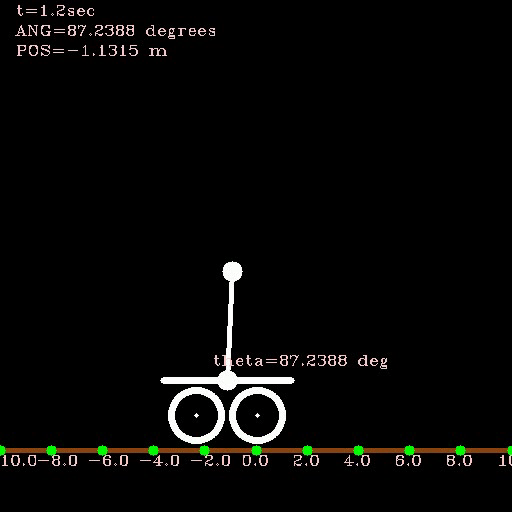

# lazy_robotics_workspace
experimental area for lazy robotics projects with minimal functionality and minimal explanation to get started fast.

Quick notes:
# LazyBot

DC motor currently being used is: http://xinhemotor.bossgoo.com/geared-motors/gear-motor-xh-gm-370-metal-gear-motor-with-48-cpr-encoder-and-two-channel-hall-effect-encoder-13156509.html
The encoder on the motor is giving 48*(~34 = gear ratio)=1632 counts per rev, with 2 of the hall sensors working in quadrature mode. In other words, reading just 1 rising edge of 1 hall sensor would give 408 encoder interrupts.

# RL
## Policy Evaluation
Temporal difference (TD) is a method that utilizes Markov property to get an estimate of the value ("goodness") of being in a specific state within an environment. TD updates the value of a state, towards it's own estimate of the value in the next state. TD(0) specifically keeps track of only previous state to compute the current state value. There is no model of the environment here, state estimation is acquired via sampling from the environment. 
### TD with state Aggregation in Random Walk Environment
- Aggregate the states close to each other under a "feature"
- Each feature gets a weight to produce a "state value"
- Apply semi-gradient TD update for updating weights during random walk
- Propagate the learnt weights to the next episode to keep learning

### TD with state Aggregation in Random Walk Environment
- Represent the states with one-hot encoding 
- Generate a NN which has # states many inputs and single output for estimating the state value
- Use ADAM optimization and TD update to update the weights at each agent step
- Propagate the learnt weights to the next episode to keep learning

### Deep SARSA on Cartpole
- Includes the implementation of inverted pendulum, from https://github.com/mpkuse/inverted_pendulum. Duration of each action is 0.2s. Resolution of the solver for the pendulum dynamics is 0.1s.
- Currently, pole starts upright with some offset, just to make sure agent learns how to balance by moving. If it starts perfectly upright, agent rather quickly learns just to stand still to keep balancing it. 
- SARSA bootstraps off of the value that it's going to take next, which is sampled from it's own policy. So it learns about the "goodness" of its own policy.
- DNN is used to estimate the value of state-action pair. Output of DNN has same size as action space (1 value for each action)
- The crucial point is that; update on the "target" happens with the already decided (known) next_action and next_state: --> on-policy
    target[action] = (reward + self.discount_factor * self.model.predict(next_state)[0][next_action])
- For Deep Q learning, we will see that the above equation changes to: (so next_action won't be needed to do bootstrapping-->which makes it off-policy)
    target[action] = (reward + self.discount_factor * np.amax(self.model.predict(next_state)[0]))

