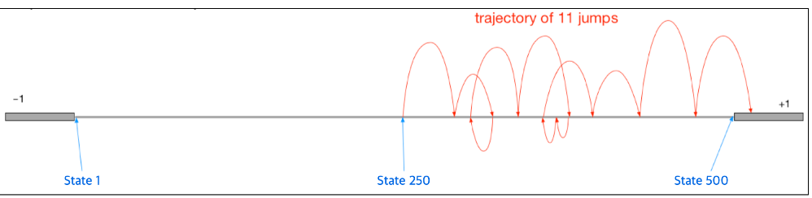
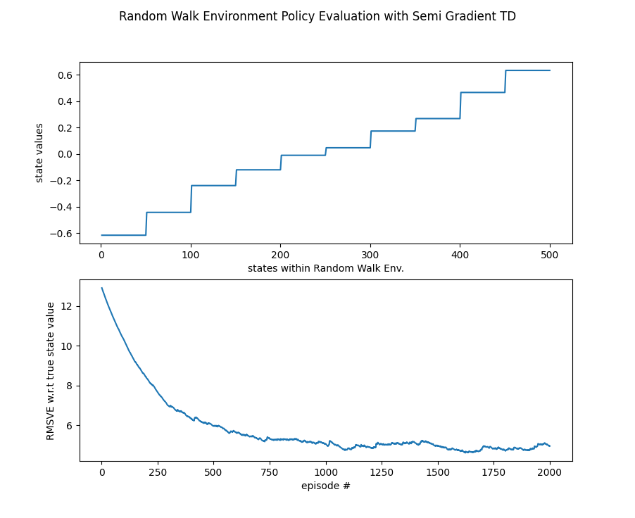
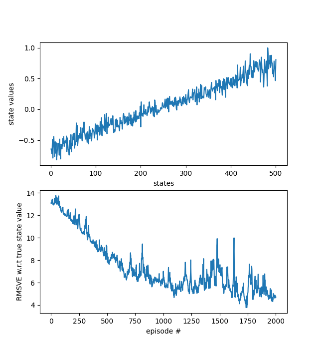

# lazy_robotics_workspace
experimental area for lazy robotics projects with minimal functionality and minimal explanation to get started fast.

Quick notes:
# LazyBot

DC motor currently being used is: http://xinhemotor.bossgoo.com/geared-motors/gear-motor-xh-gm-370-metal-gear-motor-with-48-cpr-encoder-and-two-channel-hall-effect-encoder-13156509.html
The encoder on the motor is giving 48*(~34 = gear ratio)=1632 counts per rev, with 2 of the hall sensors working in quadrature mode. In other words, reading just 1 rising edge of 1 hall sensor would give 408 encoder interrupts.

# RL

## TD with state Aggregation in Random Walk Environment
- Aggregate the states close to each other under a "feature"
- Each feature gets a weight to produce a "state value"
- Apply semi-gradient TD update for updating weights during random walk
- Propagate the learnt weights to the next episode to keep learning

## TD with state Aggregation in Random Walk Environment
- Represent the states with one-hot encoding 
- Generate a NN which has # states many inputs and single output for estimating the state value
- Use ADAM optimization and TD update to update the weights at each agent step
- Propagate the learnt weights to the next episode to keep learning

